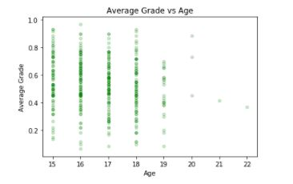
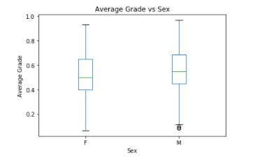
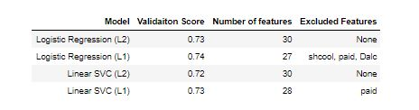
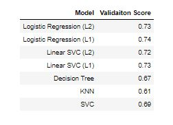
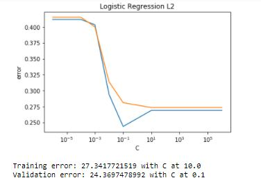
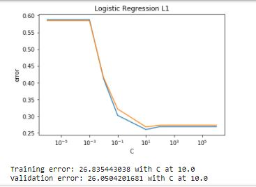

# Report

This projects uses the [Student Performance Data Set]((http://archive.ics.uci.edu/ml/datasets/Student+Performance) from the UCI machine learning repository. The objective of the project is to build a model and select features from the data set that can best predict whether or not I student passed or failed a course making this a classification problem with two labels. `1` if the student passed `0` if the student failed.

After downloading the data the data the first step was deriving the response variable to be used in the model. The data set provides three grades per student so the average of these 3 grade columns were used as the response and called `G`. Then each grade column was normalized to percentages so the response has a range from 0 to 1. This was followed by a relabeling of the response, giving each student a 0 if their mark was below 0.5 and 1 if their mark was equal to or greater than 0.5.

Next columns that were not strings were factorized. Now that the data was in a more preferred format, a table of summary statistics were to displayed to get a quantitative perspective of the data. I felt that age and sex may be variables with a larger effect on the response so a scatter plot of the average grades of each student over age was created followed by a box plot of average grade vs sex.

Next the data was partitioned randomly into training set and test set. 30 percent of the observations were used in the test set and 70 percent of the data were used in the training set. Because this is a classification problem I decided to experiment with the following models: Logistic regression, Linear SVC, Decision Tree, KNN, and SVC. Both L2 and L1 regularization was used for logistic regression and linear SVC.

In the first run of linear regression and linear SVC default parameters were used. Logistic regression using L1 regularization had the lowest validation error and selected the least amount of features.

For Decision Tree, KNN, and SVC hyperparameters were chosen using `GridSearchCV`. These gave significantly less favorable results then the previous models.

Since logistic regression had the best score I dove deeper into analysis with that model seeing if I could improve its performance by optimizing hyperparameter C.

After adjusting the hyperparameter C for both L2 and L1 logistic regression, at optimal value for C for L2 it out performs the optimal value for C at L1.

In conclusion, A logistic regression model should be chosen with all features included with a C values at 0.1 using L2 regularization to predict whether students passed. These results make sense given the problem objective. Classifying whether or not a student passed or failed is a binary classification problem. Logistic regression performs well in these kind of problems. L2 regularization is keeping all the features in the model and out performs L1 when hyperparameter C is optimized for each model. This may be because L1 regularization drops some features that explain some of the variation of the response.
